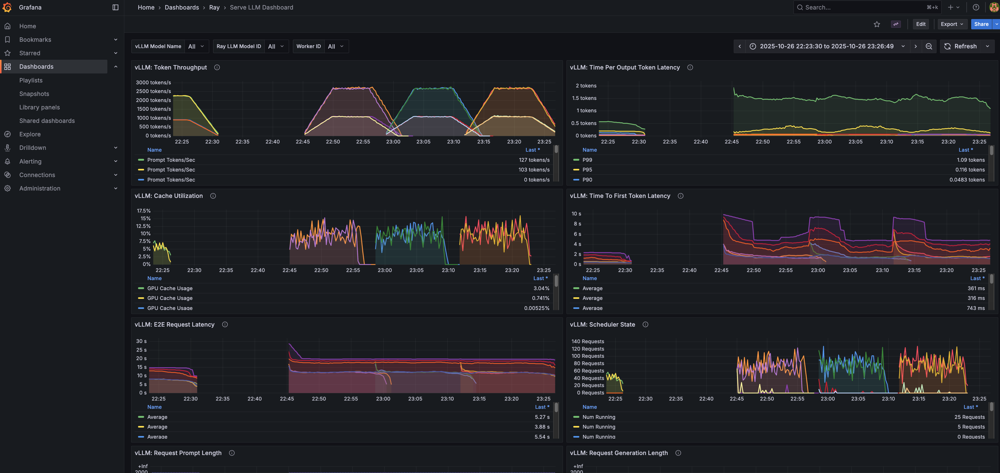

# vLLM Ray Metrics Integration Guide



## Overview
This guide documents how to enable Ray metrics collection for vLLM when using Ray Data LLM. This solution was developed through investigation and has been confirmed as the correct approach by the Ray team.

**Prerequisites:** Follow the guide from [Ray Cluster Metrics](https://docs.ray.io/en/master/cluster/metrics.html) to install Promtheus and Grafana for monitoring Ray cluster metrics.

## Background
While vLLM provides [Prometheus and Grafana integration](https://docs.vllm.ai/en/v0.7.2/getting_started/examples/prometheus_grafana.html), and Ray Serve has [LLM observability support](https://docs.ray.io/en/master/serve/llm/user-guides/observability.html), **Ray Data LLM does not have out-of-the-box vLLM metrics integration**.

### Key Differences:
- **Ray Serve**: Has a dedicated `LLMConfig` with `log_engine_metrics=True` option
- **Ray Data LLM**: No such configuration option exists, requiring manual integration

## Problem
By default, vLLM metrics are not automatically exported via Ray's metrics system when using Ray Data LLM integration. The "Serve LLM Dashboard" in Grafana shows no metrics for Ray Data LLM deployments, despite vLLM having Ray metrics wrappers available.

## Solution

The solution involves leveraging vLLM v1's Ray metrics wrappers ([vllm.v1.metrics.ray_wrappers](https://docs.vllm.ai/en/latest/api/vllm/v1/metrics/ray_wrappers.html)) which forward vLLM counters/histograms into `ray.util.metrics`. This approach has been confirmed by the Ray team (Kourosh Hakhamaneshi) in [slack thread](https://ray.slack.com/archives/C08H0M37WLQ/p1761686813471059?thread_ts=1760636442.990289&cid=C08H0M37WLQ) as the correct way to integrate vLLM metrics with Ray Data LLM.

### 1. Enable Ray Metrics in vLLM Engine
Since Ray Data LLM doesn't expose the `stat_loggers` parameter (unlike Ray Serve's `LLMConfig`), you need to modify the engine initialization. In the Ray Data LLM engine initialization, import and use `RayPrometheusStatLogger`:

```python
# In ray/llm/_internal/batch/stages/vllm_engine_stage.py

# In vLLMEngineWrapper.__init__ method:
self._vllm_config = engine_args.create_engine_config()

# add the below block
if not engine_args.disable_log_stats:
    from vllm.v1.metrics.ray_wrappers import RayPrometheusStatLogger
    self.engine = vllm.AsyncLLMEngine.from_engine_args(engine_args, stat_loggers=[RayPrometheusStatLogger])
else:
    self.engine = vllm.AsyncLLMEngine.from_engine_args(engine_args)
```

**Important**: The `vllm.AsyncLLMEngine` accepts a `stat_loggers` parameter, but this is not exposed in the Ray Data LLM APIs, requiring this manual modification.

### 3. Configure Ray Data LLM Pipeline
In your pipeline configuration, ensure metrics are enabled:

```python
processor_config = vLLMEngineProcessorConfig(
    model_source=self.config.model_name,
    engine_kwargs={
        # ... other settings ...
        "disable_log_stats": False,  # Enable vLLM stats logging. It is by default set to False, you may skip mentioning it.
    },
    runtime_env={
        "env_vars": {
            "VLLM_USE_V1": "1",  # Use vLLM v1 which has Ray metrics support
            # ... other env vars ...
        },
    },
)
```

### 4. Initialize Ray with Metrics Export
```python
ray.init(
    _metrics_export_port=8080,  # Prometheus metrics endpoint
    include_dashboard=True,
    dashboard_host="0.0.0.0"
)
```

## Available Metrics

**Note:** The `RayPrometheusStatLogger` sanitizes the the opentelemetry name in the [vllm.v1.metrics.ray_wrappers](https://docs.vllm.ai/en/latest/api/vllm/v1/metrics/ray_wrappers.html).
So all the messages are emitted with prefix `ray_vllm` and import it as Ray Data LLM dashboard.

You can make a copy of the Ray Serve LLM dashboard and replace all the prom ql `vllm:` with `ray_vllm`.

Once configured, the following [vLLM v1 metrics](https://docs.vllm.ai/en/latest/design/metrics.html#v1-metrics) are available via Ray:


- **Request Metrics**:
  - `ray_vllm_num_requests_running` - (Gauge) - Number of requests currently running.
  - `ray_vllm_num_requests_waiting` - (Gauge) - Number of requests currently waiting
  - `ray_vllm_request_success_total` -Number of finished requests by their finish reason: either an EOS token was generated or the max sequence length was reached.
  
- **Performance Metrics**:
  - `ray_vllm_time_to_first_token_seconds` - (Histogram) - Time to First Token (TTFT) latency in seconds.
  - `ray_vllm_time_per_output_token_seconds` - Inter-token latency (Time Per Output Token, TPOT) in seconds.
  - `ray_vllm_e2e_request_latency_seconds` - End to end request latency measured in seconds.
  
- **Throughput Metrics**:
  - `ray_vllm_prompt_tokens_total` - Number of prompt tokens processed.
  - `ray_vllm_generation_tokens_total` - Number of generation tokens produced
  
- **Resource Metrics**:
  - `ray_vllm_kv_cache_usage_perc` - Fraction of used KV cache blocks (0–1).
  
- **Prefix Caching Metrics** (if enabled):
  - `ray_vllm_prefix_cache_queries` - (Counter) - Number of prefix cache queries.
  - `ray_vllm_prefix_cache_hits` - (Counter) - Number of prefix cache hits.

## Accessing Metrics

### Via Prometheus Endpoint
```bash
curl http://localhost:8080/metrics | grep vllm
```

### Via Grafana Dashboard
1. Configure Prometheus data source pointing to Ray's metrics endpoint
2. Import vLLM dashboard or create custom dashboards
3. Example query for throughput:
   ```promql
   rate(ray_vllm_generation_tokens[5m])
   ```

### Via Ray Dashboard
Navigate to http://localhost:8265/metrics to see all Ray and vLLM metrics.

### Via Grafana's "Ray Data LLM Dashboard"
I made a copy of the Ray Serve LLM dashboard and replaced all the prom ql `vllm:` with `ray_vllm` and imported it as the "Ray Data LLM Dashboard".

Once the integration is complete, the "Ray Data LLM Dashboard" will show vLLM metrics for all the running vLLM engines. You can find it in [ray_data_llm_dashboard.json](grafana/ray_data_llm_dashboard.json).

## Benefits

1. **Unified Monitoring**: All metrics (Ray Data, vLLM, system) in one place
2. **Production Ready**: Scales with Ray cluster
3. **No Manual Collection**: Automatic metric export
4. **Rich Insights**: Detailed performance metrics for optimization

## Example Dashboard Queries

```promql
# Images processed per second
rate(ray_vllm_request_success[1m])

# Average TTFT
histogram_quantile(0.5, rate(ray_vllm_time_to_first_token_seconds_bucket[5m]))

# GPU Memory Utilization
ray_vllm_kv_cache_usage_perc * 100

# Request Queue Length
ray_vllm_num_requests_waiting
```

## Future Improvements

Based on feedback from the Ray team:

1. **Make it Configurable**: The `stat_loggers` parameter should be exposed in Ray Data LLM's configuration, similar to Ray Serve's `LLMConfig.log_engine_metrics`.

3. **Dedicated Dashboard**: Instead of reusing the "Serve LLM Dashboard", a dedicated "Ray Data LLM Dashboard" would be more appropriate.

4. **GitHub Issue**: A feature request should be filed to make this integration more elegant and out-of-the-box.

## References

- [vLLM Prometheus/Grafana Guide](https://docs.vllm.ai/en/v0.7.2/getting_started/examples/prometheus_grafana.html)
- [vLLM v1 Metrics](https://docs.vllm.ai/en/latest/design/metrics.html)
- [Ray Serve LLM Observability](https://docs.ray.io/en/master/serve/llm/user-guides/observability.html)
- [vLLM Ray Metrics Wrappers API](https://docs.vllm.ai/en/latest/api/vllm/v1/metrics/ray_wrappers.html)
- [Ray Cluster Metrics](https://docs.ray.io/en/master/cluster/metrics.html)
